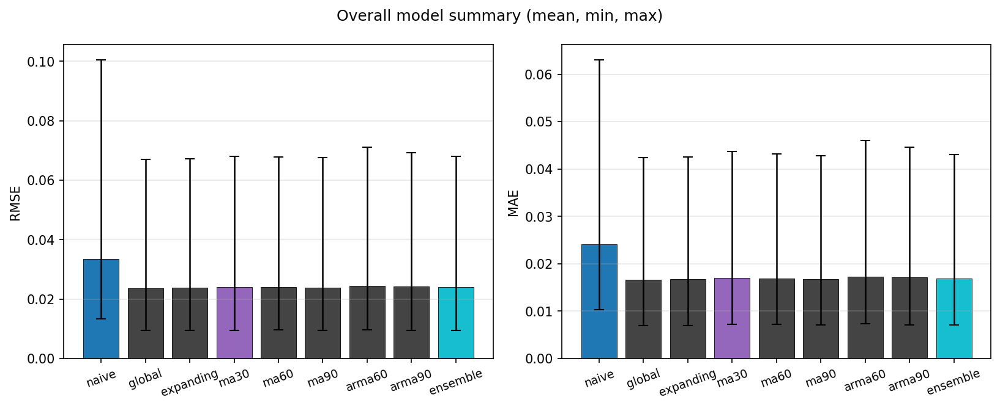
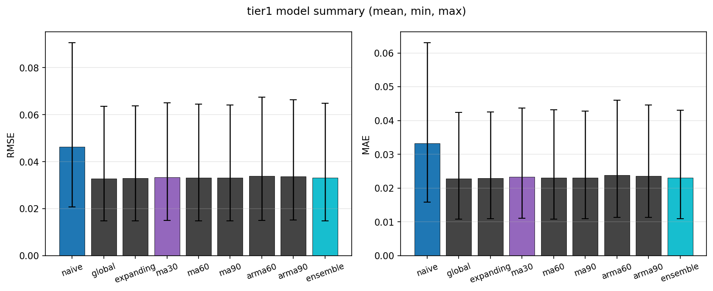
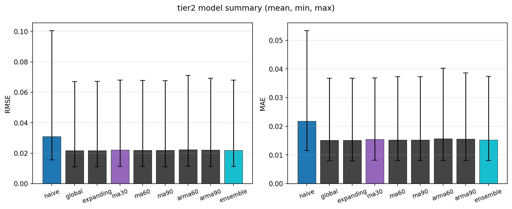
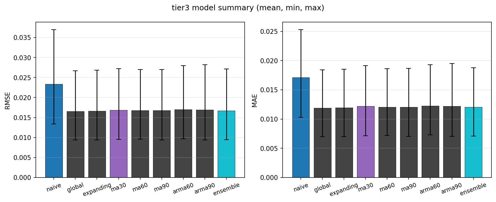
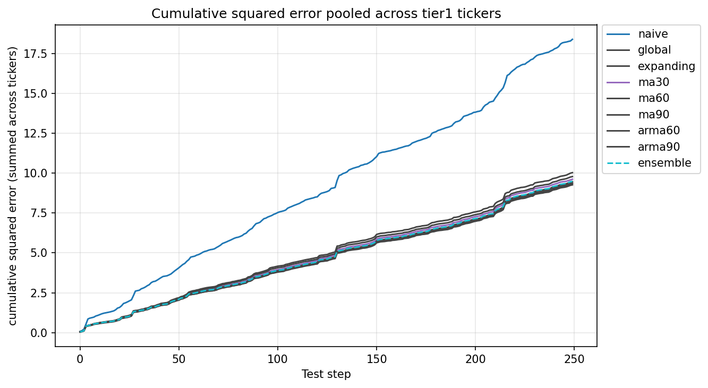
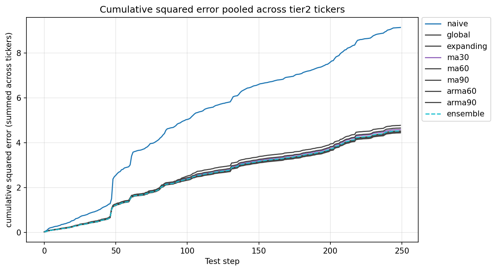
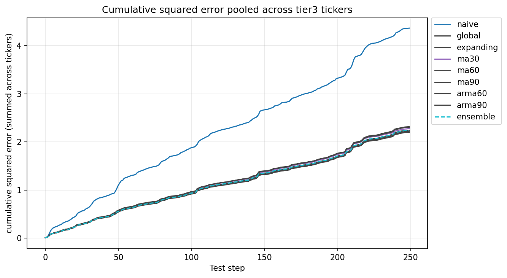
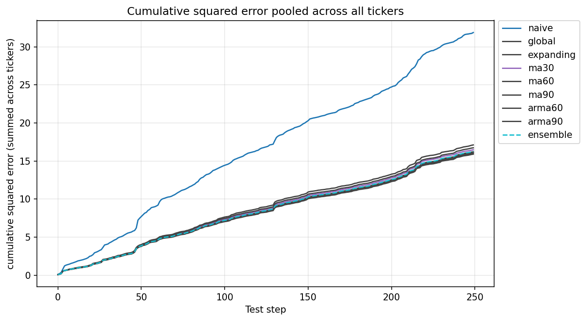
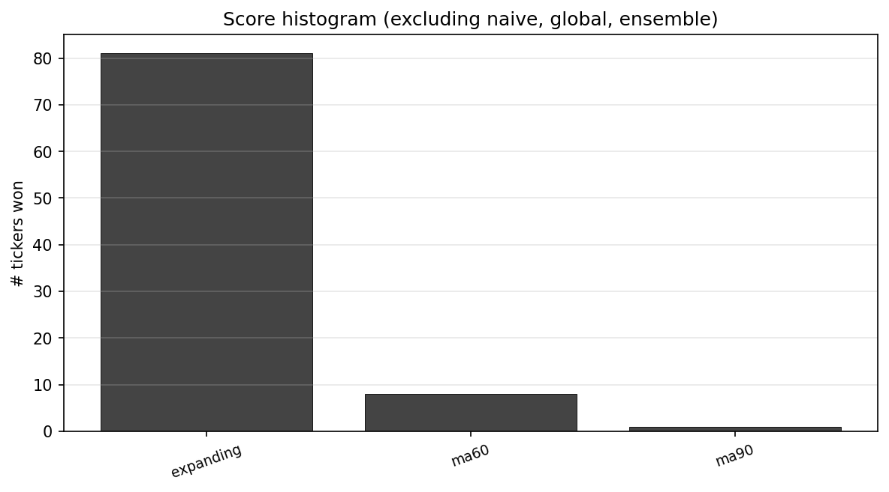
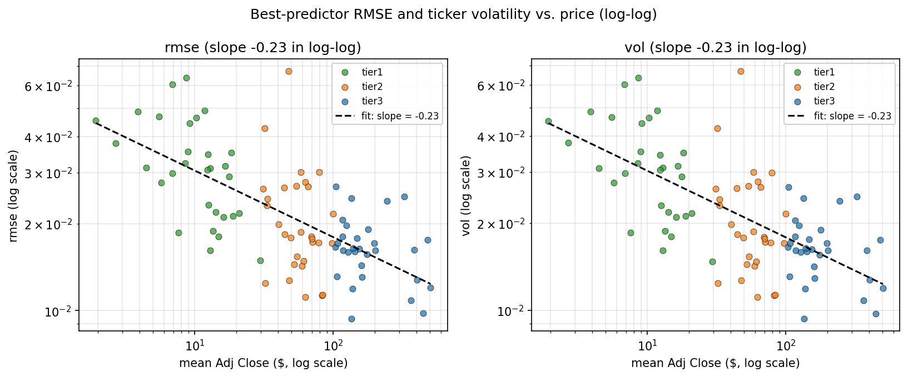

# Forecasting Stock Returns: Simple Baselines vs. AIC-Selected ARMA

**Solo project — JoonHak Kim (NYUAD)**



<br>
<br>

## 1. Project Introduction

### 1-1. Project Overview

ARMA models are a textbook tool for short-horizon time-series forecasting. On
real equity data, though, daily returns sit right at the edge of what any
linear model can extract — autocorrelation is weak, noise dominates, and the
conditional mean is close to zero.

This project benchmarks **eight one-step-ahead forecasters** on the
**daily log returns** of 90 US equities drawn from the Russell 3000, split
into three **price-based tiers** (small / medium / large). Every model
predicts the same 252 trading days of 2023, and we score each
`(ticker, model)` pair with RMSE and MAE.

The point isn't to find a magic forecaster — it's to measure exactly **how
much, or how little, structure each model can squeeze out** of daily
returns, and to verify the textbook result that a sample mean beats both
a naive predictor and a fitted ARMA on noise-dominated series.

<br>

### 📁 1-2. Related Materials

* Full write-up (LaTeX) : [REPORT.tex](./REPORT.tex)
* Models implementation : [src/models.py](./src/models.py)
* Pipeline entry point  : [src/runner.py](./src/runner.py)

<br>
<br>

## 2. Preparation

### 2-1. Dataset

Daily adjusted closing prices were pulled directly from **Yahoo Finance**
via the `yfinance` Python package. The ticker universe comes from the
Russell 3000.

* Russell 3000 ticker list  
  shipped in repo at [`data/universe/russell3000.txt`](./data/universe/russell3000.txt)

* Daily adjusted closes (`Adj Close`)  
  fetched at runtime via `yfinance.download(...)` — adjusts for splits and
  other corporate actions so the return series is artefact-free.

* Sample window  
  `2022-08-15 → 2023-12-31`. The scored test period is `2023-01-01 →
  2023-12-31` (~252 trading days). The extra ~90 trading days of burn-in
  let the longest-window models (MA(90), ARMA(90)) start on test-day 1
  with a full lookback already in hand.

* Tier assignment (purely by mean adjusted price over the window):

  | tier   | label   | mean price band |
  |--------|---------|-----------------|
  | tier 1 | small   | `< $30`         |
  | tier 2 | medium  | `[$30, $100]`   |
  | tier 3 | large   | `> $100`        |

  The pipeline randomly samples **30 tickers per tier** (90 total) from the
  Russell 3000 universe — reproducible via the `--seed` flag.

<br>

### 2-2. Other Tools

* `statsmodels` — ARMA fitting with AIC order selection on the grid
  `p, q ∈ {0..4}`.
* `numpy` / `pandas` — return computation and rolling windows.
* `matplotlib` — every figure in section 4.
* `SQLite` — local price cache at `ticker_data/cache.db`; runs after the
  first one don't re-hit Yahoo.

<br>
<br>

## 3. Code

[Data loading](./src/data.py) — cache-aware `load_returns` on top of
`yfinance`.

[Models](./src/models.py) — `Naive`, `GlobalMean`, `ExpandingMean`,
`MovingAverage(s)`, `ARMA(W)`, and the unweighted ensemble.

[Rolling driver](./src/rolling.py) — per-model lookback window walker.

[Evaluation](./src/evaluate.py) — one-ticker-at-a-time RMSE / MAE.

[Pipeline runner](./src/runner.py) — CLI entry, tier sampling, parallel
ticker evaluation.

[Summaries & plots](./src/summary.py), [plotting registry](./src/plots.py).

To reproduce the full benchmark end-to-end:

```bash
pip install -r requirements.txt
python -m pytest tests/ -x --tb=short   # 39 tests, ~45s
python -m src.runner --seed 42 --force  # full run, ~25 min
```

<br>
<br>

## 4. Visualizations

### 4-1. Per-tier Results

For each price tier, the cumulative squared error is pooled across the
tier's 30 tickers (one line per model), and a companion bar chart shows
the per-model mean RMSE / MAE with whiskers spanning the tier
minimum-to-maximum.

**Tier 1 (small cap, mean price < $30) — per-model RMSE / MAE summary**


**Tier 2 (mid cap, $30 ≤ mean ≤ $100) — per-model RMSE / MAE summary**


**Tier 3 (large cap, mean > $100) — per-model RMSE / MAE summary**


The same model ordering shows up in every tier: `global` sits at the
bottom of the cluster, the four central-tendency causal models
(`expanding`, `ma30`, `ma60`, `ma90`) sit next to it within a few
thousandths, the two ARMAs sit a little above, and `naive` is well
separated above the pack. The tier mean RMSE itself drops monotonically
with price — small caps are the noisiest, large caps the calmest.

**Cumulative squared error within each tier**




<br>

### 4-2. Overall Results

Flattening across the three tiers (90 tickers in total) gives the pooled
view.

**Cumulative squared error across all 90 tickers**


`naive` separates from the tight central-tendency cluster within the first
few weeks and stays separated for the rest of the year.

**Overall per-model RMSE / MAE summary**


Pooled mean RMSE per model:

| model      | mean RMSE  | comment                                  |
|------------|------------|------------------------------------------|
| `global`   | ≈ 0.0237   | lowest, by construction (peeks at test)  |
| `expanding`| ≈ 0.0238   | **best causal forecaster**               |
| `ma90`     | ≈ 0.0239   |                                          |
| `ma60`     | ≈ 0.0239   |                                          |
| `ensemble` | ≈ 0.0239   | unweighted mean of 6 causal children     |
| `ma30`     | ≈ 0.0241   |                                          |
| `arma90`   | ≈ 0.0243   |                                          |
| `arma60`   | ≈ 0.0245   |                                          |
| `naive`    | ≈ 0.0335   | highest                                  |

The empirical `naive / central-tendency` RMSE ratio is `0.0335 / 0.0237 =
1.414`, matching the theoretical √2 to four significant figures.

<br>

### 4-3. Model Win Counts

For each ticker we take the model with the lowest RMSE and award it +1
win. Summed across all 90 tickers — `naive`, `ensemble`, and `global`
excluded (trivial / derived / future-leaking) — we get:



`expanding` wins **81 of 90 tickers**, `ma60` wins 8, `ma90` wins 1;
`ma30`, `arma60`, and `arma90` win zero. The expanding-window mean is the
single best causal forecaster on this slice, just barely separated from
the longer-window moving averages.

**Best causal model vs. mean stock price**


The winning forecaster doesn't change systematically with price tier —
`expanding` dominates uniformly across small, medium, and large caps.

<br>
<br>

## 5. Closing

### Project Conclusion

On daily log returns of 90 stocks across three price tiers (Russell 3000,
30 tickers per band), the **central-tendency baselines dominate**.
Constant-mean and equal-weight rolling-mean forecasts are essentially
indistinguishable from each other and clearly better than `naive`, ARMA,
or a flat ensemble of the lot.

A few takeaways:

* **The √2 result holds empirically.** Under near-zero conditional
  autocorrelation, `naive` has prediction variance `2σ²` vs. `σ²` for any
  mean estimator — RMSE ratio `√2`, exactly what the data shows
  (`1.414`).

* **ARMA does not pay for its complexity.** AIC selects small orders on
  noisy data, and the fitted coefficients add estimation noise that more
  than offsets any tiny autocorrelation captured. Both `arma60` and
  `arma90` sit slightly above the central-tendency cluster — never
  below.

* **The expanding mean beats every fixed-length MA window.** Once you've
  accepted that the conditional mean is roughly constant and roughly
  zero, the best estimator of that mean is the one that uses the most
  data — i.e., expanding rather than rolling.

* **Per-tier RMSE tracks volatility, not price.** Log returns are
  dimensionless, but small caps have wider return distributions than
  large caps, so every model has more error to make on tier 1.

The bigger lesson from running this end-to-end: on noise-dominated
financial time series, **the choice of estimator class matters far less
than the recognition that the signal is small in the first place**. A
correctly applied sample mean is a strong, theoretically grounded
benchmark — and a fitted ARMA without a real autoregressive signal is
just an expensive way to add estimation variance to your forecast.

<br>

### 🔨 Tech Stack

- Python 3.11
- `yfinance`, `pandas`, `numpy`
- `statsmodels`, `scipy`
- `matplotlib`
- `pytest` (39-test suite)
- SQLite (price cache)

<br>
<br>
